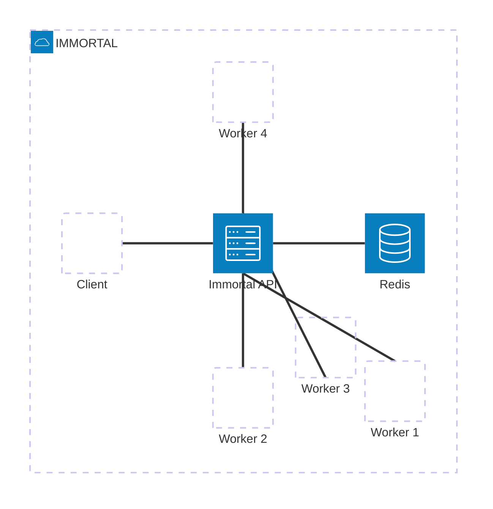

# Immortal

Immortal is a Rust-based framework for building, running, and interacting with asynchronous
workflows and activities using gRPC, HTTP/REST, and Socket.IO interfaces. Inspired by Temporal,
it enables you to define long-running, reliable workflows and worker-driven activities
in Rust with minimal boilerplate.

<!-- toc -->
## Table of Contents
1. [Goals](#goals)
2. [Features](#features)
3. [Architecture Overview](#architecture-overview)
4. [Getting Started](#getting-started)
   - [Prerequisites](#prerequisites)
   - [Building Protobufs](#building-protobufs)
   - [Building the Project](#building-the-project)
   - [Running the Server](#running-the-server)
   - [Running a Worker](#running-a-worker)
   - [Client Example](#client-example)
5. [Directory Layout](#directory-layout)
6. [Contributing](#contributing)
7. [License](#license)
<!-- tocstop -->

## Goals
- Be as lightweight as possible. Temporal is great, however, for a production environment, it requires a fully featured database and a decent amount of memory to run. Immortal, on the other hand, requires about 10MiB to run + redis db. 
- Allow for one-off rpc calls. Instead of tracking every single workflow and having full durability for every single action, Immortal allows for one-off rpc calls as you would normally do with a rpc/grpc server. However the benefit with this is that it is fully dynamic and doesn't require for you to know the grpc server's address, function name & parameters during build time. You can just connect to the Immortal server and call a task-queue + activity-name during runtime.
- Typesafety/documentation. As every function requires the JsonSchema trait. Workers allow full visibility of their inputs and outputs, allowing for them to be consumed during runtime and displayed nicely in a UI.
- Provide a Rust-native workflow orchestration system with familiar concepts: workflows,
  activities, signals, and queries.
- Offer gRPC and HTTP/REST endpoints for server interaction, plus real-time notifications
  via Socket.IO.
- Minimize boilerplate with procedural macros (`#[wf]`) and auto-generated schemas for
  workflow signatures.
- Ensure reliability and scalability through Redis-backed task queues and health checks.

## ToDo
- Hardden & make production ready. Includes writing tests.
- Add serverless support (allow for serverless workers)
- Allow for easy scaling (multi-node support)

## Features

- **Workflows & Activities**: Define async Rust functions for workflows and activities.
- **Auto Schema Generation**: Derive JSON schemas for workflows and activities automatically.
- **gRPC & HTTP APIs**: Expose core services over gRPC and Axum-based HTTP/REST.
- **Socket.IO Events**: Stream real-time workflow/activity events to browser or front-end.
- **Redis Integration**: Back-end persistence and messaging via Redis streams.
- **Extensible Client**: Built-in client helpers to start, execute, call, and notify workflows.

## Architecture Overview



- **Server** (`src/server.rs`): Hosts gRPC + HTTP endpoints, dispatches workflow and activity tasks,
  and streams events.
- **Worker** (`src/worker.rs`): Registers activity and workflow implementations, polls queues,
  and executes user code.
- **Client** (`src/client.rs`): Example CLI demonstrating how to start and query workflows.
- **Macros** (`immortal-macros`): Provide `#[wf]` for workflows schema and boilerplate reduction.
- **Protos** (`proto/`): Define API contracts for workflows, activities, calls, and notifications.

## Getting Started

### Prerequisites

- Rust (1.64+)
- `protoc` compiler
- Redis server

### Building Protobufs

Protobuf definitions are compiled automatically via `build.rs`. To regenerate:

```bash
cargo build
```

### Building the Project

```bash
cargo build --release
```

### Running the Server

```bash
# start Redis first, then
export IMMORTAL_URL=http://localhost:10000
cargo run --release --bin server
```

### Running a Worker

```bash
# in a separate shell
export IMMORTAL_URL=http://localhost:10000
cargo run --release --bin worker
```

### Client Example

```bash
cargo run --release --bin client
```

## Directory Layout

```text
.
├── proto/                # Protobuf definitions
├── build.rs              # Protobuf compilation script
├── immortal-macros/      # Proc-macro crate for workflow/feature macros
├── src/
│   ├── lib.rs            # Core client, macros, and re-exports
│   ├── server.rs         # gRPC + HTTP/Socket.IO server
│   ├── worker.rs         # Worker process for running code
│   ├── client.rs         # Example CLI client
│   ├── api/              # Axum HTTP/REST router (v1)
│   ├── models/           # Domain models: Workflow, Activity, History, Schema
│   └── workflows/        # Sample workflow implementations
└── Cargo.toml
```

## Contributing

Contributions are welcome! Please open issues or pull requests for bugs, enhancements,
or documentation improvements.

## License

This project is unlicensed. Feel free to adapt and integrate per your organization’s policies.
